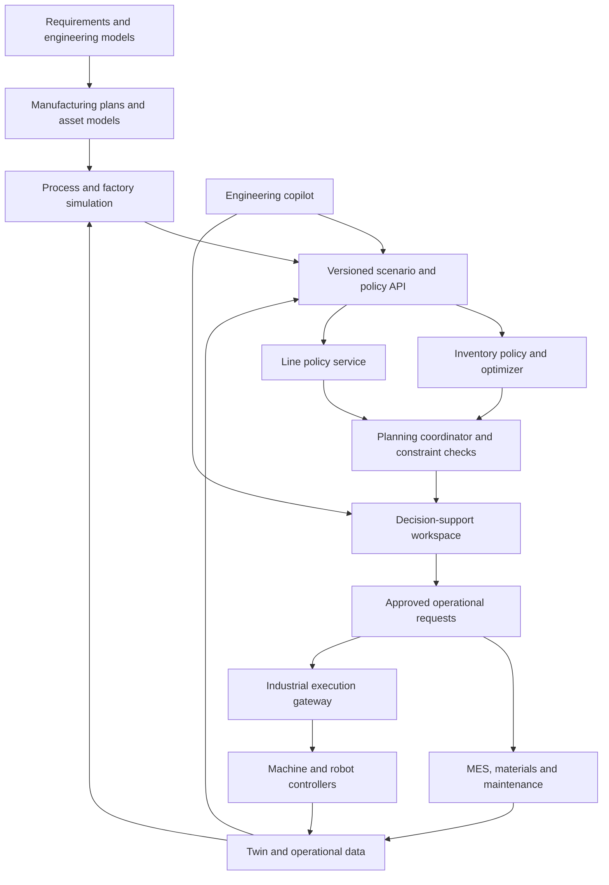

# JFXOSMS — Open Microfactory Simulation and AI Decision Architecture

**Consolidated English proposal · Revision: 2026-09-15**

**Project:** [robotics-intelligent-systems/jfxosms][jfxosms]

JFXOSMS is conceived as a modular environment for designing, simulating, operating, and improving microfactories. This consolidated proposal extends its manufacturing and digital-twin compendium with three complementary development blocks: inventory optimization, manufacturing-line optimization, and an operator decision-support interface.

The proposed result connects engineering models, production scenarios, material availability, equipment behavior, and reviewed operational decisions in one traceable workflow. It combines deterministic optimization and simulation with learned policies and an optional engineering copilot.

**Implementation status:** this document is an architecture and development specification. The adapters, services, contracts, and deployment profiles described here are proposed work; their inclusion does not mean that they already exist in JFXOSMS. The three supplied Bonsai repositories were inspected as reusable examples, including relevant source files and licenses. Their historical hosted-service workflows are not prerequisites for the proposed local implementation.

**Suggested short project description**

> Microfactory engineering and simulation platform integrating digital twins, inventory optimization, manufacturing-line policies, and operator decision support through modular services and reproducible AI evaluation.

## Table of Contents

- [1. Project purpose and engineering lifecycle](#project-purpose)
- [2. Integration principles and boundaries](#integration-principles)
- [3. Verified sources and integration status](#source-status)
- [4. Consolidated architecture](#consolidated-architecture)
- [5. Categorized software compendium](#software-compendium)
- [6. Bonsai integration proposal and package references](#bonsai-integration)
- [6.1 Inventory management development block](#inventory-block)
- [6.2 Manufacturing-line optimization development block](#line-block)
- [6.3 Decision-support development block](#decision-support-block)
- [7. Middleware and service contracts](#middleware-contracts)
- [8. Coordinated inventory and production workflow](#coordinated-workflow)
- [9. AI engineering and knowledge services](#engineering-ai)
- [10. Digital twin and simulation consistency](#simulation-consistency)
- [11. Deployment profiles](#deployment-profiles)
- [12. Evaluation and measurable outcomes](#evaluation)
- [13. Engineering requirements and acceptance criteria](#requirements)
- [14. MVP and delivery roadmap](#roadmap)
- [15. Proposed repository organization](#repository-organization)
- [16. Licensing, maintenance, and adoption](#licensing-maintenance)
- [17. Source references and revision snapshots](#references)

---

<a id="project-purpose"></a>

## 1. Project Purpose and Engineering Lifecycle

The existing [JFXOSMS description][base-readme] covers microfactory engineering, additive and subtractive manufacturing, robotics, process simulation, digital twins, industrial connectivity, and factory operations. This proposal retains those domains and adds a coordinated decision layer for materials and production.

The engineering sequence remains **MBSE → CAD → CAM → CAS**, with feedback from simulated and observed operations.

| Stage | Purpose in the consolidated project | Representative outputs |
|---|---|---|
| MBSE | Define system boundaries, responsibilities, constraints, and verification cases | Requirements, capability models, interface definitions |
| CAD | Describe products, fixtures, cells, and factory layouts | Versioned geometry and asset identifiers |
| CAM | Prepare additive, machining, and robotic production plans | Toolpaths, operation sequences, task definitions |
| CAS | Evaluate process behavior, factory flow, inventory, and control alternatives | Reproducible scenarios, performance estimates, validation evidence |
| Operations | Execute approved plans and record material and equipment events | Production records, stock movements, maintenance history |
| Improvement | Compare baseline and candidate policies using the same scenarios | Reviewed policy releases and revised planning assumptions |

The expanded platform should help engineers and operators answer practical questions: Are materials available for a proposed plan? Where will the line become starved or blocked? Which policy improves service or throughput under the same constraints? What evidence supports releasing a recommendation?

<a id="integration-principles"></a>

## 2. Integration Principles and Boundaries

1. **Use replaceable components.** Keep upstream simulators, enterprise systems, model runtimes, and user interfaces behind versioned adapters.
2. **Start with simulation and baselines.** Establish inventory and line-control reference policies before training a replacement.
3. **Separate decision horizons.** Inventory planning, production scheduling, line supervision, and real-time machine control have different clocks and responsibilities.
4. **Make constraints explicit.** Resource limits, reservations, approved operating ranges, and data freshness must be checked independently of model predictions.
5. **Keep operational authority clear.** Planning services propose orders; MES or enterprise workflows release them. Industrial controllers retain responsibility for machine behavior and protective functions.
6. **Preserve reproducibility.** Record simulator revisions, seeds, observations, transformations, policy artifacts, constraints, and approval events.
7. **Provide local operation.** A local simulator, optimizer, and policy-serving path should support the MVP. Compatibility with an existing Bonsai brain is an optional profile.

The project scope is microfactory engineering and operations. The three new blocks complement CAM, process physics, MES, and maintenance; none of them independently implements those domains.

<a id="source-status"></a>

## 3. Verified Sources and Integration Status

| Source | Observed capability | Consequence for this architecture |
|---|---|---|
| [JFXOSMS][jfxosms] | Architecture README and engineering diagram assets in the inspected tree | Treat the consolidated design as a development proposal, not a report of deployed services |
| [bonsai-InventoryManagement][inventory] | Nested documentation and Python code for a hybrid safety-stock policy plus multi-SKU optimization | Reuse the simulation and optimization structure; add material-system adapters and independently enforced constraints |
| [bonsai-ManufacturingLineOptimization][line] | SimPy-based production-line simulation, per-machine speed policies, assessments, and Bonsai integration | Reuse the line benchmark and policy interface; calibrate a microfactory-specific model |
| [bonsai-decision-support-interface][decision] | Experimental Streamlit interface for an exported brain, state/action display, and CSV export | Evolve it into a reviewed recommendation workspace with typed data and an audit service |

All three SDK2035 forks carry an MIT license. Their corresponding Microsoft parent repositories were marked archived at review time; the inspected SDK2035 forks were not marked archived. That distinction does not establish active maintenance or compatibility with current runtimes. See the [repository references and snapshots](#references).

Two source details materially affect integration:

- The inventory repository's root README is largely a template; its useful technical explanation is in [bonsai/readme.md][inventory-guide].
- Both inventory and line repositories have a minimal `interface.json` with placeholder `empty` fields. Concrete contracts must be recovered from Python and Inkling definitions, then validated against actual simulator behavior.

The packages concern **Microsoft Project Bonsai** workflows. The hosted training platform, SDKs, exported model artifacts, and MIT-licensed examples are distinct dependencies. This proposal does not assume that an old cloud endpoint remains available.

<a id="consolidated-architecture"></a>

## 4. Consolidated Architecture

The architecture has an engineering path, a simulation path, and an operational decision path. Shared asset and scenario identifiers connect them.



The **planning coordinator** is a new JFXOSMS service. It reconciles material availability and line capacity, associates recommendations with a common planning revision, and routes them to the appropriate authority. It does not merge all decisions into a single reinforcement-learning agent.

The **industrial execution gateway** is also proposed integration work. In the first release, operational requests remain simulated or advisory. Enabling physical execution is a later commissioning decision supported by machine-specific validation.

<a id="software-compendium"></a>

## 5. Categorized Software Compendium

The following table consolidates the original component families and adds the three requested blocks. Existing candidates are retained from the [source compendium][base-readme]; their precise upstream identity, license, and interoperability still require individual adoption review where indicated.

| Category | Components or references | Proposed architectural role |
|---|---|---|
| Engineering foundation | Arcadia / Capella; CAD models | System architecture, requirements traceability, geometry, and factory layouts |
| A. Additive toolpaths | ORNLSlicer; IceSL-vrprinter; libSLM | Slicing, path inspection, and specialized SLM data or machine adapters |
| B. Subtractive manufacturing | CAMotics | CNC path verification within a separate machining workflow |
| C. Hybrid manufacturing | ASMBL | Connect additive operations with subsequent milling steps |
| D. Process and materials simulation | JAX additive-manufacturing simulation; ExaCA; PeriLab | Thermal/process studies, microstructure evolution, and damage analysis; identify the exact JAX project |
| E. Welding and AM reference | Abaqus WeldToolkit | Optional external validation dependent on the required commercial environment |
| F. Robotics and microfactory cells | open-microfactory; Open Drone project | Assembly and robotic-cell integration; resolve the ambiguous drone entry before selection |
| G. Factory-flow simulation | FactorySimPy; generic discrete-event simulation | Orders, queues, resources, transport, and production-flow scenarios |
| H. Digital-twin services | OpenTwin; CoFmuPy; Digital Twin as a Service | Twin and co-simulation candidates; treat DTaaS as a pattern until its upstream is identified |
| I. Production and logistics twins | Open Factory Twin; IndustryFusion Process Data Twin | Factory state, logistics context, and semantic process information |
| J. Industrial connectivity | IndustryFusion | Industrial data acquisition and normalization |
| K. Deployment and coordination | OpenFactory | Versioned asset configuration and deployment workflows |
| L. Manufacturing applications | Open Industry Project | Candidate warehouse and manufacturing application services; validate the exact APIs |
| M. MES, OEE, and operations | Libre; Manufacturing Efficiency & Maintenance Management Platform; OEE and CMMS Software for Machine Manufacturers | Production execution and performance records; resolve generic platform names |
| N. Asset management | BaseEAM | Equipment history, maintenance, spares, and work orders |
| External automation reference | Factory I/O | Optional commercial training or validation adapter |
| **O. Inventory decision AI** | **[bonsai-InventoryManagement][inventory]** | **Per-SKU safety-stock policy followed by coordinated purchase-order optimization** |
| **P. Line decision AI** | **[bonsai-ManufacturingLineOptimization][line]** | **Simulation-based machine-speed policy development and comparison** |
| **Q. Operator decision support** | **[bonsai-decision-support-interface][decision]** | **Recommendation inspection, comparison, and a starting point for an approval interface** |
| R. Local learning extensions | [Gymnasium][gymnasium]; [Stable-Baselines3][sb3] | Proposed environment wrappers and local reinforcement-learning training |
| S. Engineering AI and data services | LangGraph; MCP; Qdrant; PostgreSQL; FastAPI; MLflow | Candidate bounded workflows, retrieval, APIs, persistence, and experiment records |
| T. Model serving and visibility | Ollama; llama.cpp; vLLM; optional Open WebUI; OpenTelemetry; Prometheus; Grafana | Candidate inference, portal, telemetry, and dashboards |

The original optional **gpt-oss-20b** and **gpt-oss-120b** model tiers remain model-routing candidates, subject to resource and model-license review. Open-weight model availability is distinct from the licensing of surrounding software.

The compendium is a selection framework. A deployment should choose one component per necessary responsibility rather than install every alternative.

<a id="bonsai-integration"></a>

## 6. Bonsai Integration Proposal and Package References

The three requested sources form a practical development package:

| Block ID | Reference | Main decision | Intended consumer |
|---|---|---|---|
| `AI-INV` | [Inventory Management][inventory] | Safety-stock targets and constrained order proposals | Materials planner, warehouse or enterprise system |
| `AI-LINE` | [Manufacturing Line Optimization][line] | Candidate machine-speed setpoints | Simulation runner and authorized line-supervision service |
| `AI-DSI` | [Decision Support Interface][decision] | Display and review recommendations | Engineers, planners, and operators |

These blocks share schemas and scenario context, while preserving separate model ownership, release histories, and decision horizons.

<a id="inventory-block"></a>

### 6.1 Inventory Management Development Block

**Source:** [sdk2035/bonsai-InventoryManagement][inventory] · [Technical guide][inventory-guide]

The source describes a hybrid approach: a learned policy selects safety stock for an individual SKU, and an optimizer coordinates orders across SKUs and capacity limits. Its example models a multi-echelon supply chain with forecast uncertainty, inventory costs, and missed-demand costs. The example uses three controlled stock stages; a general microfactory bill of materials is an extension, not an existing feature.

| Responsibility | Proposed JFXOSMS adaptation |
|---|---|
| Material-state input | Translate warehouse stock, reservations, in-transit orders, forecasts, and lead times into a versioned planning snapshot |
| Policy input | Map per-SKU observations to the trained feature contract |
| Policy output | Obtain nonnegative safety-stock targets for each modeled stage |
| Optimization | Combine targets and demand with shared resource constraints to generate feasible order proposals |
| Review and release | Attach costs, service estimates, and feasibility evidence to a material-plan revision |
| Feedback | Reconcile received quantities and realized demand with the next planning snapshot |

The [training connector][inventory-training] exposes observations including `transit_orders`, `demand_actual`, `demand_forecast`, `demand_sigma`, `inventory`, `leads`, and the missed-sale-to-holding-cost ratio. Its policy actions include `safety_stock_stage0` through `safety_stock_stage2`. The adapter must preserve stage ordering, forecast-window lengths, and units.

**Proposed microfactory extensions**

- Map raw materials, consumables, work in progress, and finished goods to explicit SKU and location identities.
- Deduct reservations consistently and associate demand with production-plan revisions.
- Model supplier calendars, batch sizes, shelf-life constraints, and bill-of-material consumption only after adding corresponding simulator behavior.
- Compare a deterministic policy, optimization alone, and learned safety stock plus optimization on the same scenarios.

A proposed business objective is to minimize holding cost, missed-demand cost, and any explicitly modeled ordering or expediting costs, subject to material and resource constraints. Extra cost terms are JFXOSMS extensions; they must not be reported as implemented source features.

**Implementation constraints**

The [solver source][inventory-solver] explicitly notes fixed-lead-time support, while the guide identifies variable-lead-time training as experimental and unvalidated. The first integration should therefore use fixed lead times.

The source connector also contains constraint-relaxation and fallback paths. JFXOSMS must independently check the final order proposal and reject violations of non-negotiable limits. A relaxed solver result is not evidence of operational feasibility. Some solver variables are continuous: conversion to actual order quantities must include pack-size or integer constraints and a subsequent feasibility check.

**Fallback:** retain a validated deterministic replenishment policy. If no feasible plan exists, return the infeasibility and affected demand to the planner rather than silently releasing an arbitrary order.

<a id="line-block"></a>

### 6.2 Manufacturing-Line Optimization Development Block

**Source:** [sdk2035/bonsai-ManufacturingLineOptimization][line] · [Simulator connector][line-connector]

The source uses a numerical production-line simulator with machines, conveyors, buffer conditions, downtime, and speed decisions. It supports comparison of learned and heuristic policies. The inspected [layout configuration][line-layout] sets `K = 12`; [the Inkling policy schema][line-inkling] also fixes twelve machine actions. Changing topology therefore requires coordinated updates to the simulator, policies, schemas, and trained model.

| Item | Proposed integration treatment |
|---|---|
| Observations | Machine states, actual speeds, proximity indicators, and the permitted operational subset of simulator state |
| Actions | Map source fields `m0` … `m11` to stable machine IDs and validated speed units |
| Decision timing | Support a configured fixed, event-driven, or combined supervisory cadence |
| Objective | Compare good-output throughput against downtime, buffering, quality, and resource constraints that are explicitly modeled |
| Output | Candidate speed vector plus the actual vector accepted by the simulator or controller |
| Baselines | Evaluate the source max-speed, bottleneck-speed, and proximity-based heuristics |

The [source policies][line-policies] contain those baseline functions and fixed machine-speed arrays. Their limits are benchmark parameters, not ratings for a real production machine.

**Required extensions for JFXOSMS**

1. Calibrate processing times, conveyor capacities, startup behavior, and failure distributions against a chosen cell.
2. Separate simulator-only information from deployable observations. Do not train on future downtime or exact buffer information that an installed sensor system cannot provide.
3. Record units and conversions explicitly; resolve the source's mixture of unitless simulation steps and documented time intervals.
4. Add constrained rate changes, equipment availability, and output-quality criteria appropriate to the selected process.
5. Publish both recommended and applied actions, including any controller override.

A proposed evaluation objective balances **good production output**, starvation, blocking, excessive work in progress, and action changes. Energy, scrap, and tool-wear terms should be added only when the simulator and measurements support them. These additions are not already delivered by the example.

The original repository discusses a sample throughput improvement. That result is not a JFXOSMS performance promise and is not adopted as a release target. Local evidence must compare candidate and baseline policies under matched scenarios.

**Fallback:** use the commissioned deterministic supervisory strategy. Loss of inference must not disable equipment interlocks or change the controller's established protective behavior.

<a id="decision-support-block"></a>

### 6.3 Decision-Support Development Block

**Source:** [sdk2035/bonsai-decision-support-interface][decision] · [UI source][decision-ui]

The repository offers an experimental Streamlit application that obtains a brain schema, accepts state values, requests an action, and displays a state/action history with CSV export. It is a useful presentation prototype.

The [current UI][decision-ui] creates scalar numeric widgets, while the inventory and line packages use array-valued observations. Therefore, connecting these packages requires an array-aware form or a versioned flattening adapter; the source UI is not a ready-made front end for either simulator.

**Proposed workspace capabilities**

| View | Purpose |
|---|---|
| Scenario selection | Choose facility, line, SKU group, horizon, and data revision |
| Input inspection | Show observed values, units, age, source, and missing-data warnings |
| Policy comparison | Compare deterministic, solver-only, and learned-policy alternatives |
| Material planning | Inspect stock targets, order proposals, service estimates, and binding limits |
| Production supervision | Compare candidate and accepted machine speeds with line KPIs |
| Decision review | Approve, reject, or request a revised proposal within the user's assigned authority |
| History and evidence | Retrieve scenarios, policy versions, constraints, decisions, and actual outcomes |

Authentication, authorization, durable audit records, approval workflows, and production-grade networking are proposed additions. A local CSV export alone does not satisfy these responsibilities.

**Protocol compatibility matters:** the [decision-support client][decision-client] uses `GET /validation.json` and a `GET` request with a JSON body to `/v1/prediction`. The [inventory policy client][inventory-policies] uses `POST` for prediction. JFXOSMS should expose one normalized interface and implement a tested, per-provider translation behind it. Do not assume that changing the base URL makes the clients interchangeable.

<a id="middleware-contracts"></a>

## 7. Middleware and Service Contracts

Introduce a small shared integration layer with explicit component ownership.

| Proposed service | Responsibility | Boundary |
|---|---|---|
| Scenario Registry | Store scenario definitions, input hashes, revisions, and seeds | Does not modify source system records |
| Simulation Adapter | Normalize reset, observation, step, and result handling | Owns one simulator instance per run |
| Policy Gateway | Route requests to a baseline, local learned policy, or compatible exported brain | Does not independently release operational actions |
| Inventory Optimizer | Convert safety-stock targets into coordinated order proposals | Returns feasibility status and binding constraints |
| Planning Coordinator | Reconcile material plans and production capacity | Prevents incompatible plan revisions from being combined |
| Decision and Audit Service | Record review, approval, rejection, expiry, and applied results | Separates proposal from execution authority |
| Operations Adapters | Exchange validated events and requests with MES, warehouse, or maintenance systems | Enforce idempotency and source-system ownership |

### Proposed API surface

These endpoints are a design contract; they are not claims about existing upstream endpoints.

| Method and path | Purpose |
|---|---|
| `POST /api/v1/scenarios` | Register a versioned scenario and its input references |
| `POST /api/v1/simulation-runs` | Start a scenario with a selected simulator and policy revision |
| `GET /api/v1/simulation-runs/{run_id}` | Retrieve progress, termination reason, and results |
| `POST /api/v1/recommendations` | Request an advisory inventory or line recommendation |
| `GET /api/v1/recommendations/{recommendation_id}` | Inspect the proposal and supporting evaluation |
| `POST /api/v1/recommendations/{recommendation_id}/decisions` | Record an authorized approval, rejection, or requested revision |
| `GET /api/v1/policies/{policy_id}/schema` | Retrieve observation, action, and compatibility definitions |

All mutations should use idempotency keys. Decision endpoints must verify recommendation expiry and the expected plan revision. An approval records authority; execution still passes through the responsible operational service.

### Example recommendation envelope

The following example is **illustrative proposed JSON**, with synthetic data and no real order or machine instruction:

```json
{
  "schema_version": "jfxosms.recommendation.v1",
  "recommendation_id": "rec-demo-001",
  "scenario_id": "scenario-demo-001",
  "plan_revision": "plan-demo-r3",
  "block": "AI-INV",
  "mode": "advisory",
  "observed_at": "2026-09-15T10:00:00Z",
  "valid_until": "2026-09-15T10:15:00Z",
  "policy": {
    "id": "inventory-baseline-demo",
    "version": "0.1.0",
    "provider": "local"
  },
  "input_snapshot": {
    "id": "materials-demo-r7",
    "freshness": "valid",
    "unit_profile": "items-and-days"
  },
  "proposal": {
    "sku_id": "SKU-DEMO-01",
    "safety_stock_by_stage": [12, 18, 24],
    "order_requests": [
      {
        "stage_id": "stage-0",
        "quantity": 30,
        "unit": "item"
      }
    ]
  },
  "feasibility": {
    "status": "feasible",
    "constraint_set_id": "limits-demo-r2",
    "violations": []
  },
  "approval": {
    "status": "pending",
    "required_role": "materials_planner"
  }
}
```

The release schema must additionally define required fields, numeric bounds, units, time zones, permissible states, and error responses. Cost estimates and predictive intervals belong to separately identified evaluation evidence; do not insert an uncalibrated model “confidence” score.

### Schema and adapter rules

- Attach stable IDs to SKUs, stages, machines, conveyors, assets, and facilities.
- Version feature order, array dimensions, normalization, missing-data treatment, and action mappings with the model artifact.
- Reject stale, out-of-order, incompatible, or non-finite inputs before inference.
- Enforce request deadlines and distinguish provider failure, invalid input, infeasibility, and evaluation failure.
- Isolate stateful policy sessions by scenario and episode. The inventory example includes a memory-reset function; validate the actual exported artifact's lifecycle rather than sharing memory across runs.
- Keep original HTTP methods confined to their compatibility adapters.

<a id="coordinated-workflow"></a>

## 8. Coordinated Inventory and Production Workflow

The integration should reconcile two interacting planning loops without assuming they run at the same frequency.

| Loop | Proposed initial cadence | Decision | Responsible system |
|---|---|---|---|
| Material planning | Per planning cycle, shift, or relevant supply event | Stock targets, replenishment proposals, available-to-produce quantities | Materials planner and enterprise workflow |
| Production planning | Per dispatch or capacity revision | Feasible batches, sequence, and resource allocation | Planning coordinator and MES |
| Line supervision | Validated simulator interval or equipment event | Candidate machine-speed settings | Supervisory service |
| Equipment control | Controller-defined cycle | Low-level actuation and protective behavior | Machine or robot controller |

Cadences are design choices to be calibrated; they are not measured performance claims.

### Proposed end-to-end sequence

1. Read a consistent demand, stock, reservation, equipment, and maintenance snapshot.
2. Generate an inventory proposal and identify available material envelopes.
3. Evaluate production scenarios against those envelopes and current equipment capacity.
4. Use the line block to compare permitted supervisory policies within each scenario.
5. Return achievable throughput and material-consumption estimates to the planning coordinator.
6. Reconcile the material and production plans, using a bounded number of planning iterations and a documented feasibility tolerance.
7. Present the alternatives, constraint results, and uncertainty evidence in the decision workspace.
8. Release an approved plan through the relevant enterprise or execution adapter.
9. Record actual receipts, consumption, production, and overrides for reconciliation and later evaluation.

If coordination fails to converge, return the unresolved material or capacity conflict for review. Do not publish mutually incompatible plans.

**Illustrative microfactory scenario:** material delivery is delayed while a packaging machine experiences downtime. The inventory block revises replenishment proposals; the production coordinator reduces or reschedules affected batches; the line block evaluates supervisory settings for feasible batches. The operator sees the combined delivery and throughput consequences before releasing the revised plan. This is a proposed scenario, not a reported deployment.

<a id="engineering-ai"></a>

## 9. AI Engineering and Knowledge Services

The existing engineering-copilot direction remains useful for requirements, documentation, scenario preparation, and analysis.

| AI capability | Proposed use | Required evidence or limit |
|---|---|---|
| Engineering retrieval | Find manuals, process assumptions, and validation reports | Cite document revision and relevant passage |
| Scenario assistance | Draft demand or downtime experiments | Validate parameters against the simulator schema |
| Experiment orchestration | Run approved simulator and solver tools | Use bounded tool APIs and resource limits |
| Result explanation | Summarize cost, throughput, and constraint differences | Derive numeric claims from recorded results |
| Maintenance analysis | Connect condition records with work-order history | Keep maintenance release in the responsible workflow |
| Report generation | Prepare engineering and operator summaries | Preserve scenario, model, and source references |

Local or private inference can support documentation retrieval and analysis. Deterministic solvers should compute numerical feasibility. Learned policies should produce actions only within their declared observation and action contracts.

### Proposed open local learning path

[Gymnasium][gymnasium] provides an environment API and [Stable-Baselines3][sb3] provides reinforcement-learning implementations. Both repositories publish MIT licenses. They are proposed complementary development dependencies, not existing JFXOSMS integrations.

Develop separate environment wrappers for inventory and line simulation. A first local experiment may use PPO with a fixed-dimensional numeric observation vector and bounded action representation. For inventory, transform candidate stock levels through the validated optimization stage. For line supervision, train and evaluate with the same action constraints and fallback behavior that serving will use.

A local retraining path does not automatically execute Inkling curricula or convert a Bonsai exported brain. Translate curriculum logic, reset behavior, rewards, constraints, and termination conditions into explicit local configuration, then verify comparable scenario behavior.

<a id="simulation-consistency"></a>

## 10. Digital Twin and Simulation Consistency

The twin should retain three distinct views: **observed state**, **simulated state**, and **proposed state**. Every recommendation must identify the view and snapshot from which it was derived.

| Concern | Required design treatment |
|---|---|
| Manufacturing representations | Relate requirements, part revisions, toolpaths, process models, and factory operations through persistent IDs |
| Material balance | Reconcile receipts, consumption, scrap, transfers, and finished output using explicit units and bill-of-material revisions |
| Time management | Record wall-clock timestamps separately from simulator time and planning periods |
| Multiple simulators | Assign ownership of each buffer and resource; avoid counting the same material in FactorySimPy and the line simulator |
| State synchronization | Consume versioned events; detect duplicates, gaps, and stale observations |
| Co-simulation | Use a defined stepping and synchronization contract when combining FMUs and discrete-event models |
| Model fidelity | State which effects are represented, calibrated, omitted, or only approximated |

The proposed inventory and manufacturing-line adapters do not inherently implement FMI/FMU or the OpenTwin API. Those integrations require dedicated code and compatibility tests.

For the first integrated scenario, use one authoritative production-flow model. If FactorySimPy and the source SimPy line model are composed later, define the transfer boundary, time advance, and ownership of work in progress before coupling them.

<a id="deployment-profiles"></a>

## 11. Deployment Profiles

| Profile | Components | Release boundary |
|---|---|---|
| A. Local baseline laboratory | Simulators, deterministic policies, inventory optimizer, scenario storage, decision workspace | Simulation and advisory use |
| B. Local learned-policy laboratory | Profile A plus environment wrappers, local training, model registry, and inference service | Reproducible training and comparison |
| C. Existing Bonsai artifact compatibility | Profile A plus a compatible exported brain and isolated protocol adapter | Only after artifact, runtime, schema, and access verification |
| D. Connected shadow operation | Read-only operational adapters and live snapshots with candidate decisions logged | Operational recommendations remain unexecuted |
| E. Reviewed operational integration | Authorized enterprise adapters and separately commissioned supervisory execution | Approval, constraint checks, expiry, rollback, and controller authority enforced |

For initial deployment, separate UI, integration API, simulator workers, optimizer, and persistence into independently managed processes or containers. Use a queue only when run concurrency requires it. A single-host deployment can establish the contracts before introducing a multi-node platform.

Linux and Docker are candidate deployment foundations. Kubernetes or k3s and GitOps-style configuration management remain optional scale-out choices; select and qualify them according to the operational footprint.

The historical requirements include older NumPy, pandas, Streamlit, and Bonsai SDK versions. Isolate a reproducibility environment from the modernization branch. Do not combine all legacy dependency files into one environment or present their installation as validated on a current runtime.

For connected profiles, add authenticated access, service identities, encrypted transport, audit retention, and separation between simulation and execution networks. Credentials should be supplied through an appropriate secret mechanism, not copied from repository environment files.

<a id="evaluation"></a>

## 12. Evaluation and Measurable Outcomes

No improvement percentage is promised by this proposal. Compare alternatives under the same demand, equipment, and resource scenarios.

| Domain | Metrics | Comparison |
|---|---|---|
| Inventory | Holding cost, missed-demand cost, fill rate, stockout duration, capacity violations | Deterministic replenishment; optimizer alone; learned stock policy plus optimizer |
| Manufacturing line | Good units per simulated time, blocking, starvation, work in progress, downtime | Source heuristics and commissioned baseline versus candidate policy |
| Joint planning | On-time feasible production, material-plan consistency, total modeled operating cost | Independent decisions versus coordinated plans |
| Decision support | Input completeness, review duration, decision traceability, override reasons | Existing review process versus the proposed workspace |
| Integration | Invalid-action rejection, stale-input handling, deadline failures, recovery behavior | Required interface and fallback cases |

Define **fill rate** as fulfilled demand units divided by requested demand units for the selected horizon. Define **good throughput** using accepted units rather than all produced units. OEE reporting requires separately defined availability, performance, and quality inputs; throughput alone is insufficient.

### Evaluation protocol

1. Establish reproducible baseline runs with fixed dataset and simulator revisions.
2. Split training, validation, and evaluation scenarios to avoid tuning on release cases.
3. Use matched random seeds when comparing policies, including demand spikes, equipment outages, and scarce-resource cases.
4. Report per-scenario outcomes and paired differences, with intervals appropriate to independent runs or episodes.
5. Select the number of runs based on variance and the decision being made; do not treat a single training curve as deployment evidence.
6. Evaluate invalid inputs, provider timeouts, infeasible plans, unavailable sensors, and expired approvals.
7. Progress from simulation to read-only shadow operation before enabling reviewed operational requests.

The source inventory assessment configuration and historical reported results are useful starting points, but they are not a validated JFXOSMS benchmark. Preserve the new benchmark definitions and full run records.

<a id="requirements"></a>

## 13. Engineering Requirements and Acceptance Criteria

These are proposed requirements for implementation and review.

| ID | Requirement | Acceptance evidence |
|---|---|---|
| `REQ-01` | Track every recommendation to a scenario, observation snapshot, policy version, and constraint revision | Retrieve the complete lineage for a sampled recommendation |
| `REQ-02` | Reject incompatible dimensions, missing required fields, invalid units, and non-finite values | Contract cases fail explicitly before inference |
| `REQ-03` | Preserve inventory capacity and authorized order constraints after optimization and quantity conversion | Infeasible and relaxed source results cannot be released |
| `REQ-04` | Map line-policy actions to named equipment and valid supervisory ranges | Boundary, unavailable-machine, and action-rate cases follow the configured response |
| `REQ-05` | Keep review and execution authority distinct | An unapproved, expired, or superseded proposal cannot generate an operational request |
| `REQ-06` | Provide a documented deterministic fallback for each decision block | Provider failure triggers the selected fallback or a reviewed hold |
| `REQ-07` | Isolate scenario, episode, and stateful-model sessions | Interleaved runs do not contaminate one another |
| `REQ-08` | Support local baseline evaluation without a Bonsai workspace | Run the baseline benchmark in the local deployment profile |
| `REQ-09` | Prevent duplicated enterprise requests | Repeating an idempotency key creates no duplicate order or execution intent |
| `REQ-10` | Distinguish observed, simulated, recommended, and applied state | UI and audit records show the corresponding state and revision |
| `REQ-11` | Preserve deterministic controller and protective-function authority | The integration cannot bypass commissioned machine protections |
| `REQ-12` | Promote a model only with baseline comparison and reproducibility evidence | Release record contains benchmark results, limits, and rollback policy |

Latency, reliability, and resource targets must be derived from the selected planning and supervisory horizons. This document does not invent hardware-independent timing guarantees.

<a id="roadmap"></a>

## 14. MVP and Delivery Roadmap

| Phase | Development scope | Exit condition |
|---|---|---|
| 0. Source qualification | Pin revisions, inspect licenses, isolate dependencies, recover actual schemas | Reproducible source baseline and dependency inventory |
| 1. Simulation foundation | Connect one material scenario and one production line to the shared scenario contract | Repeatable runs with material and time consistency |
| 2. Deterministic decision baseline | Implement optimizer-only inventory and heuristic line policies | Baseline metrics and infeasibility behavior recorded |
| 3. Decision workspace | Extend typed input handling, comparisons, durable history, and review | Operator can inspect and decide on a complete proposal |
| 4. Local learning | Build environment wrappers and train bounded candidate policies | Reproducible held-out comparisons against the baseline |
| 5. Coordinated planning | Reconcile inventory envelopes, capacity, and production revisions | Joint scenarios produce consistent material and production plans |
| 6. Connected shadow evaluation | Ingest operational data without releasing model actions | Data quality, mismatch, and override evidence reviewed |
| 7. Reviewed operational release | Implement authorized enterprise requests and commissioned supervision | Acceptance criteria, fallback, and rollback evidence approved |

**Recommended MVP:** one configurable line, a small explicitly defined SKU set, fixed lead times, a deterministic baseline, the hybrid inventory experiment, the line-policy comparison, and a decision workspace. Its completion criterion is a reproducible and reviewable workflow.

The original manufacturing expansions remain available after that foundation: a robotic cell using open-microfactory and deployment adapters; and advanced additive-process studies involving ORNLSlicer, a verified JAX simulation project, ExaCA, PeriLab, and libSLM. Their integration should be driven by the selected microfactory's requirements.

<a id="repository-organization"></a>

## 15. Proposed Repository Organization

The following paths describe planned implementation areas. They are not a claim that these directories already exist.

| Proposed path | Contents |
|---|---|
| `README.md` | This consolidated project description and navigation |
| `MBSE/` | Requirements, architecture models, CAD/CAM/CAS assets, and traceability |
| `docs/architecture/` | Boundaries, decisions, deployment profiles, and component maps |
| `docs/compendium/` | Component identities, licenses, adoption status, and alternatives |
| `docs/evaluation/` | Benchmark definitions, reports, and model-release evidence |
| `contracts/` | Versioned observation, action, scenario, and recommendation schemas |
| `adapters/inventory/` | Source simulator and optimizer integration |
| `adapters/manufacturing-line/` | Line simulator, action mapping, and baseline-policy integration |
| `adapters/bonsai-exported-brain/` | Artifact-specific HTTP and lifecycle compatibility |
| `adapters/operations/` | MES, material-system, maintenance, and industrial data adapters |
| `simulation/` | Scenario runners, process models, factory models, and calibrations |
| `digital-twin/` | State ownership, synchronization, and co-simulation adapters |
| `services/policy-gateway/` | Policy routing, validation, deadlines, and fallback behavior |
| `services/planning-coordinator/` | Material and capacity reconciliation |
| `services/decision-audit/` | Decision records, approvals, expiry, and evidence links |
| `apps/decision-support/` | Evolved operator and engineering workspace |
| `ai/training/` | Local environment wrappers, curricula, and training configuration |
| `ai/engineering/` | Retrieval, bounded tools, and report-generation workflows |
| `deploy/` | Local and connected deployment profiles |
| `tests/contracts/` | Schema, protocol, ordering, and idempotency cases |
| `tests/scenarios/` | Deterministic baselines and representative failure cases |

Store large datasets and model artifacts in an appropriate artifact store and retain immutable identifiers in the repository. Keep credentials, personal data, and unreviewed operational exports outside version control.

<a id="licensing-maintenance"></a>

## 16. Licensing, Maintenance, and Adoption

The three requested SDK2035 repositories publish [MIT licenses][inventory-license], with corresponding licenses in the [line repository][line-license] and [decision-support repository][decision-license]. Preserve applicable notices when redistributing source or derivative code.

JFXOSMS had no repository-level license identified in the inspected tree or GitHub metadata. A maintainer should establish its intended license before distributing an implemented combined package under a single license claim.

For each adopted component, record its upstream, revision, license, dependencies, local patches, and replacement strategy. Review transitive solver/runtime terms separately from the MIT licenses of the Bonsai examples. Do the same for exported brains, model weights, datasets, and external tools.

Specific modernization work includes:

- Reconcile imports with declared dependencies and select supported, pinned environments.
- Replace deprecated APIs only alongside behavioral regression evidence.
- Replace placeholder interfaces with tested schemas.
- Correct topology assumptions, feature dimensions, and identifier mappings together.
- Add request deadlines, provider error handling, isolated sessions, and durable decision history.
- Keep archived upstream status distinct from the maintenance plan for the local integration.

Open-source code availability does not imply availability of the historical hosted Bonsai service, compatibility of a particular exported model, or official Microsoft endorsement. Optional commercial tools retained from the original compendium should remain separately provisioned adapters.

<a id="references"></a>

## 17. Source References and Revision Snapshots

### Primary project and requested packages

| Reference | Repository and documentation | Inspected revision |
|---|---|---|
| JFXOSMS architecture baseline | [Project][jfxosms] · [README][base-readme] | [b04902c][jfxosms-snapshot] |
| Inventory management | [Project][inventory] · [Nested technical guide][inventory-guide] | [842fb9e][inventory-snapshot] |
| Manufacturing-line optimization | [Project][line] · [README][line-readme] | [bec02bd][line-snapshot] |
| Decision-support interface | [Project][decision] · [README][decision-readme] | [62997ce][decision-snapshot] |

**Review date:** 2026-09-15. Revision links below are pinned to the inspected repository commits. The current repository links remain available for navigation.

### Implementation evidence

| Topic | Source |
|---|---|
| Inventory states, stock actions, and fallback paths | [Training connector][inventory-training] |
| Multi-SKU solver structure and fixed-lead-time note | [Inventory solver][inventory-solver] |
| Inventory prediction method and memory reset | [Inventory policies][inventory-policies] |
| Line simulator lifecycle | [Manufacturing connector][line-connector] |
| Twelve-machine layout and feature/action declarations | [Layout configuration][line-layout] · [Inkling model][line-inkling] |
| Line comparison policies | [Policy implementations][line-policies] |
| Scalar UI controls and state/action history | [Decision-support UI][decision-ui] |
| Legacy schema and prediction requests | [Exported-brain client][decision-client] |
| Historical dependency declarations | [Inventory requirements][inventory-requirements] · [Line requirements][line-requirements] · [UI requirements][decision-requirements] |

### Optional local-learning references

- [Gymnasium repository and environment API overview][gymnasium] · [MIT license][gymnasium-license].
- [Stable-Baselines3 repository and algorithm implementations][sb3] · [MIT license][sb3-license].

### Upstream lineage

The SDK2035 packages identify these Microsoft parent repositories, marked archived in the inspected metadata: [Inventory Management](https://github.com/microsoft/bonsai-InventoryManagement), [Manufacturing Line Optimization](https://github.com/microsoft/bonsai-ManufacturingLineOptimization), and [Decision Support Interface](https://github.com/microsoft/bonsai-decision-support-interface).

[jfxosms]: https://github.com/robotics-intelligent-systems/jfxosms
[jfxosms-snapshot]: https://github.com/robotics-intelligent-systems/jfxosms/tree/b04902c3ff9184e201d71915d4e58dc3ced059ae
[base-readme]: https://github.com/robotics-intelligent-systems/jfxosms/blob/b04902c3ff9184e201d71915d4e58dc3ced059ae/README.md
[inventory]: https://github.com/sdk2035/bonsai-InventoryManagement
[inventory-snapshot]: https://github.com/sdk2035/bonsai-InventoryManagement/tree/842fb9e184050434b4dd83fb638032e01529522b
[inventory-guide]: https://github.com/sdk2035/bonsai-InventoryManagement/blob/842fb9e184050434b4dd83fb638032e01529522b/bonsai/readme.md
[inventory-training]: https://github.com/sdk2035/bonsai-InventoryManagement/blob/842fb9e184050434b4dd83fb638032e01529522b/bonsai/main_train.py
[inventory-solver]: https://github.com/sdk2035/bonsai-InventoryManagement/blob/842fb9e184050434b4dd83fb638032e01529522b/bonsai/sims/supply_chain/mip_solver.py
[inventory-policies]: https://github.com/sdk2035/bonsai-InventoryManagement/blob/842fb9e184050434b4dd83fb638032e01529522b/bonsai/policies.py
[inventory-requirements]: https://github.com/sdk2035/bonsai-InventoryManagement/blob/842fb9e184050434b4dd83fb638032e01529522b/bonsai/requirements.txt
[inventory-license]: https://github.com/sdk2035/bonsai-InventoryManagement/blob/842fb9e184050434b4dd83fb638032e01529522b/LICENSE
[line]: https://github.com/sdk2035/bonsai-ManufacturingLineOptimization
[line-snapshot]: https://github.com/sdk2035/bonsai-ManufacturingLineOptimization/tree/bec02bd685f42c2ac4fe730f64836746d5d1f7cf
[line-readme]: https://github.com/sdk2035/bonsai-ManufacturingLineOptimization/blob/bec02bd685f42c2ac4fe730f64836746d5d1f7cf/README.md
[line-connector]: https://github.com/sdk2035/bonsai-ManufacturingLineOptimization/blob/bec02bd685f42c2ac4fe730f64836746d5d1f7cf/bonsai_integration.py
[line-layout]: https://github.com/sdk2035/bonsai-ManufacturingLineOptimization/blob/bec02bd685f42c2ac4fe730f64836746d5d1f7cf/sim/line_config.py
[line-inkling]: https://github.com/sdk2035/bonsai-ManufacturingLineOptimization/blob/bec02bd685f42c2ac4fe730f64836746d5d1f7cf/multi_speed_12.ink
[line-policies]: https://github.com/sdk2035/bonsai-ManufacturingLineOptimization/blob/bec02bd685f42c2ac4fe730f64836746d5d1f7cf/policies.py
[line-requirements]: https://github.com/sdk2035/bonsai-ManufacturingLineOptimization/blob/bec02bd685f42c2ac4fe730f64836746d5d1f7cf/requirements.txt
[line-license]: https://github.com/sdk2035/bonsai-ManufacturingLineOptimization/blob/bec02bd685f42c2ac4fe730f64836746d5d1f7cf/LICENSE
[decision]: https://github.com/sdk2035/bonsai-decision-support-interface
[decision-snapshot]: https://github.com/sdk2035/bonsai-decision-support-interface/tree/62997ce84c3c4c02bf0f779bfabc263faf7eca50
[decision-readme]: https://github.com/sdk2035/bonsai-decision-support-interface/blob/62997ce84c3c4c02bf0f779bfabc263faf7eca50/README.md
[decision-ui]: https://github.com/sdk2035/bonsai-decision-support-interface/blob/62997ce84c3c4c02bf0f779bfabc263faf7eca50/launch_decision_support.py
[decision-client]: https://github.com/sdk2035/bonsai-decision-support-interface/blob/62997ce84c3c4c02bf0f779bfabc263faf7eca50/exported_brain_interface.py
[decision-requirements]: https://github.com/sdk2035/bonsai-decision-support-interface/blob/62997ce84c3c4c02bf0f779bfabc263faf7eca50/requirements.txt
[decision-license]: https://github.com/sdk2035/bonsai-decision-support-interface/blob/62997ce84c3c4c02bf0f779bfabc263faf7eca50/LICENSE
[gymnasium]: https://github.com/Farama-Foundation/Gymnasium
[gymnasium-license]: https://github.com/Farama-Foundation/Gymnasium/blob/main/LICENSE
[sb3]: https://github.com/DLR-RM/stable-baselines3
[sb3-license]: https://github.com/DLR-RM/stable-baselines3/blob/master/LICENSE
